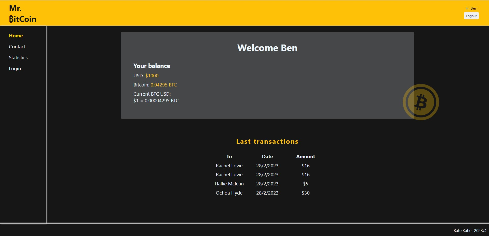

# Mr.Bitcoin

An app I wrote with Vue, in which you can transfer money to your fake contacts, CRUDL them and get information about the current Bitcoin value, the market price and more!
[Take a look, it's on Github pages](https://batelkat96.github.io/Mr.BitCoin/ "Github pages link")


___

### Table of Contents
- [Description](#description)
- [Features](#features)
- [Getting started](#getting-started)
- [Showcase](#showcase)

## Description
I decided to learn a new framework, because I want to keep expanding my knowladge and try new chalanges. That was **my motivation.** 

And a bit about the project - a small App that was built in a few days, which provides the user a list of contacts that they can transfer money to, a basic CRUDL and some information about the value of theirs fake bank currency in Bitcoin.

You are more than welcome to ***check it out*** (just enter your name and see it yourself - [right here](https://batelkat96.github.io/Mr.BitCoin/ "Github pages link"))


#### Technologies

- Vue 3
- Vue chart.js
- Vue-Router
- Vuex
- Sass
- Vue CLI & Github pages

## Features
Please feel free to take a look of the different components of the website - [Showcase](#showcase)

- Simple authentication - store and session storage.
- HTTP request for Market price, BITcoin value and more.
- Presenting data in a dashboard using charts & 3rd side library.
- CRUDL of contacts, along with User messages for different actions.
- Responsive and well designed.


## Getting started
Clone the project or dowload the files on top.
```
git clone https://github.com/BatelKat96/Mr.BitCoin.git
```
Open the terminal and enter the following lines to download the libraries and run it locally on your computer:
```
npm i
npm run dev 
```
Runs the app in the development mode.
Open http://localhost:5173 to view it in the browser.

## Showcase

### Your contacts
You can view your different contacts, filter them by name. 
In addition, you can transform money, to one of your contacts.


### Some mobile!
Just a taste of the mobile experience. I used different **mixins**, **conditional rendering**, and the **"mobile first"** approach. 
You can also see that there is an interactive **side menu** for routing.


